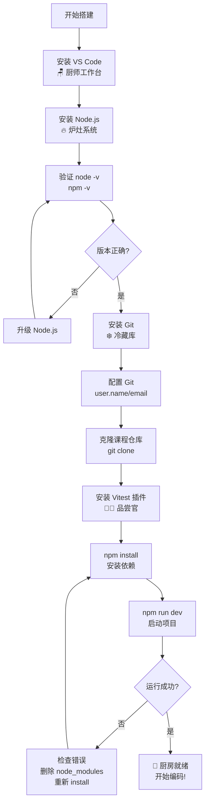
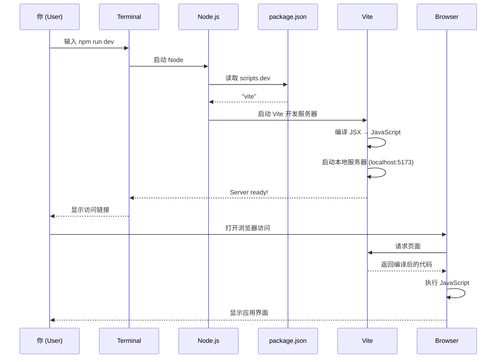

# 01 - 搭建你的开发厨房

> 🍳 **本章类比**: 搭建开发环境 = 准备一间专业厨房

想象一下：你要开一家餐厅，要做的第一件事是什么？不是直接炒菜，而是**准备好厨房**——要有工作台、炉灶、冷藏库，还要有品尝官确保每道菜质量过关。

写代码也是一样。在本章，我们要搭建一间功能齐全的"开发厨房"，为整个课程打下基础。

---

## 📍 前置知识

> **本章是课程起点**，不需要任何编程前置知识。
> 
> 但如果你对以下概念**完全陌生**，建议先花 10 分钟熟悉：
> - 🖥️ **命令行基础**：`cd`（切换目录）、`ls/dir`（列出文件）
> - 📝 **文件路径概念**：什么是文件夹、相对路径 vs 绝对路径
> 
> 💡 **不用担心**：即使不熟悉，跟着教程一步步操作也能完成！

---

## 开工前的清单

在正式"装修厨房"之前，先确认你需要准备哪些"设备"。按照课程要求，我们需要安装四件套：

| 工具 | 作用 | 我们的厨房比喻 |
|------|------|---------------|
| **VS Code** | 写代码的编辑器 | 🪑 **厨师工作台** |
| **Node.js** | 运行 JavaScript 的环境 | 🔥 **炉灶系统** |
| **Git** | 代码版本管理 | ❄️ **冷藏库 + 食谱档案** |
| **Vitest** | 自动化测试工具 | 👨‍🍳 **菜品品尝官** |

别被这些名词吓到——接下来我会逐个解释，让你秒懂它们到底是干嘛的。

---

### 开发环境搭建流程图



---

## 🪑 VS Code：你的智能工作台

VS Code 是一款**免费、开源、超级强大**的代码编辑器。如果说编程是做饭，那 VS Code 就是你的**料理台**——它上面有你需要的一切工具，而且摆放得井井有条。

### 为什么不用记事本？

你可能会想："记事本也能写字，为啥非得装 VS Code？"

想象一下：专业厨师 vs 用水果刀切牛排的门外汉。记事本就是那个"水果刀"——能用，但费劲。

VS Code 的杀手锏功能：
- 🎨 **代码高亮**：不同类型的代码用不同颜色显示，一目了然
- ✨ **自动补全**：打几个字就猜出你想写什么，像智能输入法
- 🧩 **插件生态**：需要啥功能，插件市场一搜就有
- 🐛 **断点调试**：代码出问题？随时暂停检查，像做菜时尝味道

### 安装步骤

1. 访问 https://code.visualstudio.com/download
2. 下载对应你电脑系统的版本（Windows/Mac/Linux）
3. 安装，一路点"下一步"就行

⚠️ **避坑提醒**: 课程明确禁止使用 Google Docs、Word、记事本写代码，因为它们不支持 JSX 语法高亮。

---

## 🔥 Node.js：给代码加热的炉灶

如果说 VS Code 是料理台，那 **Node.js 就是炉灶**——没有它，你的代码永远是"生"的，跑不起来。

### 代码是怎么运行的？

你写的代码（JavaScript）本质上是**纯文本**，就像食谱上的文字。Node.js 负责"烹饪"这些文字，把它们变成真正能执行的程序。

```
你的代码 (.js/.jsx) 
      ↓
  [Node.js 炉灶]  ← 加热运行
      ↓
  可执行的网页/app
```

### npm：你的调料仓库

安装 Node.js 时，你会同时获得一个叫 **npm** 的工具。它是 **Node Package Manager** 的缩写，相当于一个**调料仓库**——你想用什么第三方库（比如 React、测试工具），一声令下就自动送到你的厨房。

### 安装与验证

1. 访问 https://nodejs.org/en/download/current
2. 下载 **Latest Current** 版本（课程要求 Node 22+）
3. 安装完成后，打开终端输入：

```bash
node --version    # 应该显示 v22.x.x
npm --version     # 应该显示 10.x.x
```

💡 **TA 问答**: "Node.js 和浏览器有什么区别？"

浏览器是**餐厅大堂**（客户看到的地方），Node.js 是**后厨**（处理食材的地方）。开发时两者都用——浏览器展示界面，Node.js 运行构建工具。

---

## ❄️ Git：时间机器 + 保险柜

Git 是这节课最抽象、但也最重要的工具。把它想象成：

> **一个带时间机器功能的冷藏库 + 食谱档案馆**

### Git 解决什么问题？

想象一下这些场景：
- 你改了 100 行代码，发现不如原来好，想恢复
- 和队友一起写项目，你们的修改冲突了
- 电脑突然坏了，代码全丢了

Git 就是来解决这些问题的。它能：
- 📸 **拍照存档**：每次重要改动都保存一个"快照"
- 🕐 **时光倒流**：随时回到之前的任何版本
- 👥 **团队协作**：多人同时编辑，自动合并
- ☁️ **云端备份**：代码上传到服务器，电脑炸了也不怕

### Git 工作流程（厨房版）

```
本地厨房                总部档案馆
(你的电脑)              (KTH Git服务器)
   ↓                        ↑
  commit ──→ push ─────────┘
  (拍照存档)   (送到总部)
```

1. **commit（拍照存档）**：你对代码满意了，按个快门存下来
2. **push（送到总部）**：把存档上传到 KTH 的服务器

### 配置 Git 仓库

课程要求你的仓库命名格式：
```
https://gits-15.sys.kth.se/iprog-students/[你的用户名]-vt26-web
```

⚠️ **避坑提醒**: 
- 必须是 `gits-15.sys.kth.se`，不是 github.com！
- 第一节课前务必确认仓库已创建，没有就及时 file an issue

### Git 基础命令（必学）

第一次使用 Git，你需要配置身份（告诉 Git 你是谁）：

```bash
# 配置你的名字和邮箱（只用做一次）
git config --global user.name "你的姓名"
git config --global user.email "你的KTH邮箱"
```

日常开发的工作流程：

```bash
# 1. 查看当前状态（哪些文件被修改了）
git status

# 2. 把修改的文件加入暂存区（准备拍照）
git add .                    # 添加所有修改
git add src/App.jsx          # 只添加特定文件

# 3. 提交快照（拍照存档），写清楚这次改了什么
git commit -m "添加了搜索功能"

# 4. 推送到 KTH 服务器（送到总部档案馆）
git push origin main
```

💡 **为什么要先 add 再 commit？**  
想象你在整理行李：`add` 是把东西放进箱子，`commit` 是封箱贴标签。你可以多次 `add` 不同文件，最后一次性 `commit`。

---

## 👨‍🍳 Vitest：严格的品尝官

最后一件"厨房设备"是 **Vitest**——我们的自动化测试工具。

### 为什么需要测试？

想象一下：餐厅不能等客人投诉才发现菜咸了，对吧？**测试就是在"上菜"前发现问题**。

在本课程中，每次作业（TW）都配有测试文件。你的任务是：
1. 写代码实现功能
2. 运行测试，看看是否通过
3. 测试通过 ✅ = 可以提交
4. 测试失败 ❌ = 继续改代码

### 在 VS Code 中安装 Vitest

1. 打开 VS Code
2. 点击左侧 Extensions 图标（四个方块）
3. 搜索 "Vitest"
4. 安装带有**药水瓶图标**的那个

安装后，你可以在编辑器里直接看到测试结果：
- 绿色的 ✅：测试通过
- 红色的 ❌：测试失败，点击查看详情

### 常用测试命令

```bash
npm run test           # 运行所有测试
npm run test tw1       # 只运行 TW1 的测试
npm run test tw1.2.15  # 运行指定的某个测试
```

### 测试文件长什么样？

下面是一个真实的课程测试文件示例（`tw1.test.js`）：

```javascript
// 引入我们要测试的函数
import { describe, it, expect } from 'vitest';
import { addDishToMenu } from '../src/dinnerModel.js';

describe('TW1 - 基础功能测试', () => {
  
  it('应该把菜品添加到菜单', () => {
    // Arrange: 准备测试数据
    const dish = { id: 1, title: 'Pizza', price: 100 };
    const menu = [];
    
    // Act: 执行被测试的函数
    const result = addDishToMenu(dish, menu);
    
    // Assert: 验证结果是否符合预期
    expect(result).toContain(dish);
    expect(result).toHaveLength(1);
  });

  it('不应该添加重复菜品', () => {
    const dish = { id: 1, title: 'Pizza', price: 100 };
    const menu = [dish];
    
    const result = addDishToMenu(dish, menu);
    
    expect(result).toHaveLength(1);  // 仍然是1个，没有重复
  });
});
```

💡 **测试的三段式结构**：
1. **Arrange（准备）**：设置测试所需的数据和环境
2. **Act（执行）**：调用你要测试的函数
3. **Assert（断言）**：验证结果是否符合预期

### 项目配置文件示例

一个标准的课程项目 `package.json` 长这样：

```json
{
  "name": "dinner-planner",
  "version": "1.0.0",
  "type": "module",
  "scripts": {
    "dev": "vite",
    "build": "vite build",
    "test": "vitest"
  },
  "devDependencies": {
    "vite": "^5.0.0",
    "vitest": "^1.0.0"
  },
  "dependencies": {
    "vue": "^3.4.0"
  }
}
```

💡 **关键字段解释**：
- `"type": "module"` → 启用 ES6 模块化（支持 `import/export`）
- `"scripts"` → 自定义命令，如 `npm run dev` 实际执行 `vite`

💡 **TA 问答**: "测试失败了怎么办？"

点击失败的测试，VS Code 会显示具体的错误信息。大多数情况是：
- 函数返回值不对
- 忘了处理边界情况（比如空数组）
- 变量名拼错了

---

## 🏃‍♂️ 快速启动：第一次运行项目

环境都装好了？让我们启动第一次项目，确保一切正常：

```bash
# 1. 进入你的项目文件夹
cd [你的用户名]-vt26-web

# 2. 安装项目依赖（采购调料）
npm install

# 3. 启动开发服务器（开火做饭）
npm run dev

# 4. 运行测试（品尝官检查）
npm run test
```

如果一切正常，你应该能看到：
- 浏览器自动打开，显示 Dinner Planner 应用
- 终端显示测试运行结果

---

## 🍽️ 关于 Dinner Planner（晚餐规划器）

这门课的核心项目是做一个**晚餐规划器**，包含这些功能模块：

| 模块 | 功能 | 类比 |
|------|------|------|
| SearchFormView | 搜索菜品 | 菜单点餐系统 |
| SearchResultsView | 显示搜索结果 | 菜品展示柜 |
| DetailsView | 查看菜品详情 | 厨师介绍牌 |
| SidebarView | 显示已选菜单 | 购物车 |
| SummaryView | 生成购物清单 | 采购单 |

接下来的章节，我们会一步步搭建这个应用。现在，先确保你的"厨房"准备就绪！

---

## ⚠️ 避坑提醒（重要！）

1. **Node 版本要新**: 旧版本可能不支持课程代码，建议升级到 Node 22+
   ```bash
   npm install n -g
   n 22
   ```

2. **Git 地址别输错**: 确认是 `gits-15.sys.kth.se`，不是 `github.com`

3. **Vitest 插件必装**: 没有它，你无法在编辑器里直观看到测试结果

4. **第一次启动失败？** 尝试删除 `node_modules` 文件夹，重新运行 `npm install`

---

## 🔄 代码执行时序图

想知道当你运行 `npm run dev` 时，背后发生了什么吗？



**一句话解释**：你敲命令 → Node 读取配置 → Vite 编译代码 → 启动服务器 → 浏览器访问 → 显示页面。

---

## 💡 TA 问答

**Q: 我可以用其他编辑器吗？比如 WebStorm？**
A: 可以，但 VS Code 是课程官方推荐的，遇到问题 TA 最熟悉它的配置。

**Q: Git 太复杂了，我能不用吗？**
A: 技术上可以，但就像不开冰箱直接买菜——每次从头来。Git 是团队协作的标配，学会受益终身。

**Q: 测试太难，我能先不写吗？**
A: 课程的测试是**已经写好的**，你只需要让代码通过它们。这是帮你检查作业对不对的利器！

**Q: Mac 和 Windows 的操作有区别吗？**
A: 基本一样！只有两个小差异：
- **终端**：Mac 用 Terminal 或 iTerm；Windows 用 PowerShell 或 Git Bash
- **路径**：Mac 用 `/Users/名字`；Windows 用 `C:\Users\名字`
- **命令**：`ls` (Mac) = `dir` (Windows)，其他命令几乎相同

**Q: 安装 Node.js 时选 LTS 还是 Current？**
A: 课程要求 **Current**（最新版）。LTS 是长期支持版，适合生产环境；Current 有最新特性，课程用这个。

**Q: npm install 报错怎么办？**
A: 三大法宝：
1. **删除重装**：删掉 `node_modules` 文件夹，重新运行 `npm install`
2. **换网络**：校园网有时候连不上 npm，换手机热点试试
3. **用镜像**：`npm install --registry=https://registry.npmmirror.com`

**Q: 仓库命名格式是什么？**
A: 必须是 `你的用户名-vt26-web`，比如 `luyu-vt26-web`。不对的话自动评分系统找不到你的作业！

---

## 🎯 本章小结

搭建开发环境就像准备一间专业厨房：

| 工具 | 厨房比喻 | 核心作用 |
|------|---------|---------|
| VS Code | 智能料理台 | 写代码、调试、管理项目 |
| Node.js | 炉灶系统 | 运行代码、安装依赖 |
| Git | 冷藏库+时间机器 | 保存代码、版本控制 |
| Vitest | 品尝官 | 自动检查代码质量 |

一切准备就绪？那就开始我们的编程之旅吧！

---

## 🔗 本章关联点

### 为后续章节奠定的基础

| 本章内容 | 后续使用章节 | 用途说明 |
|---------|------------|---------|
| VS Code + Vitest 插件 | **所有章节** | 每一章都要写代码、跑测试 |
| Node.js / npm | [03 JSX Rendering](./03_jsx.md) | 安装 React/Vue 依赖 |
| Git 基础操作 | [09 Code Honour](./09_honour.md) | 代码诚信与提交规范 |
| npm run dev | [04 MVP Architecture](./04_mvp.md) | 启动项目开发服务器 |
| 测试驱动开发 (TDD) | [02 Callbacks](./02_callbacks.md) | TW1 测试即开始 |

### 前置知识
> 📍 **本章是课程起点**，不需要前置知识。但如果完全没接触过命令行，建议先熟悉基本的终端操作（cd, ls 等）。

---

## 📊 易混淆概念对比表

初学者经常被这些概念搞混。我们用"厨房类比"来帮你一眼看出区别：

### 🔥 npm vs Node.js

| 对比项 | Node.js | npm |
|:---|:---|:---|
| **厨房比喻** | 🔥 炉灶（烹饪系统） | 🏪 调料仓库管理员 |
| **本质** | JavaScript 运行环境 | 包管理工具（随 Node 附带） |
| **作用** | 执行你的代码 | 下载/管理第三方库 |
| **类比** | 厨房里的煤气灶 | 给你送食材的外卖员 |
| **使用场景** | `node app.js` 运行代码 | `npm install react` 安装依赖 |

💡 **一句话区分**：Node.js 是"炉子"，npm 是"采购员"。炉子用来炒菜，采购员用来买调料。

---

### 📝 Git vs GitHub (KTH Git)

| 对比项 | Git | GitHub / KTH Git |
|:---|:---|:---|
| **厨房比喻** | 📸 相机（拍照存档功能） | 🏛️ 总部档案馆（存储空间） |
| **本质** | 版本控制软件 | 代码托管服务器 |
| **是否必须** | 必须（本地版本控制） | 非必须，但强烈建议（云端备份） |
| **位置** | 在你的电脑上 | 在远程服务器上 |
| **类比** | 相机的拍照功能 | 存照片的硬盘/云盘 |
| **使用场景** | `git commit` 本地存档 | `git push` 上传到服务器 |

⚠️ **常见误区**：
- ❌ "我用的是 KTH Git，所以不用 Git" → 错！KTH Git 只是服务器，Git 才是工具
- ❌ "Git 就是 GitHub" → 错！Git 是软件，GitHub 是网站（本课程用 KTH Git 服务器）

💡 **一句话区分**：Git 是"拍照功能"，KTH Git 是"档案馆"。你在本地拍照，上传到档案馆保存。

---

### 🧪 Vitest vs VS Code 调试

| 对比项 | Vitest | VS Code 调试 |
|:---|:---|:---|
| **厨房比喻** | 👨‍🍳 专业品尝官 | 🔍 厨师自查 |
| **本质** | 自动化测试框架 | 编辑器内置调试工具 |
| **何时使用** | 检查代码是否符合预期（自动化） | 代码出错时逐行排查（手动） |
| **特点** | 批量运行、可重复、有报告 | 单步执行、查看变量、打断点 |
| **课程用途** | 验证 TW 作业是否通过 | 调试自己的 bug |
| **类比** | 第三方质检员 | 自己尝味道 |

💡 **一句话区分**：Vitest 是"专业质检员"（客观评分），VS Code 调试是"自己尝菜"（主观排查）。

---

### 📦 `npm install` vs `npm run dev`

| 对比项 | `npm install` | `npm run dev` |
|:---|:---|:---|
| **厨房比喻** | 🛒 采购食材 | 🔥 开火做饭 |
| **作用** | 下载项目依赖（第三方库） | 启动开发服务器 |
| **执行次数** | 每个项目只需一次（或依赖更新时） | 每次开发都要执行 |
| **类比** | 去超市买菜 | 回家炒菜 |
| **运行后** | 创建 `node_modules` 文件夹 | 打开浏览器预览项目 |
| **没做的后果** | 报错：找不到模块 | 无法预览项目 |

⚠️ **避坑提醒**：
1. 先 `install` 再 `run dev` —— 没买菜怎么炒菜？
2. 如果 `node_modules` 被删除，需要重新 `install`

---

### 🔄 commit vs push

| 对比项 | `git commit` | `git push` |
|:---|:---|:---|
| **厨房比喻** | 📸 拍照存档 | 📤 上传到云盘 |
| **作用** | 保存当前代码的快照 | 将快照上传到远程服务器 |
| **存储位置** | 本地仓库（你的电脑） | 远程仓库（KTH Git 服务器） |
| **频率** | 每完成一个小功能就 commit | 可以多次 commit 后一次性 push |
| **类比** | 按相机快门保存照片 | 把照片从相机传到电脑/云端 |
| **撤回难度** | 容易（本地操作） | 困难（已上传，他人可能看到） |

💡 **工作流程记忆法**：
```
修改代码 → git add（放进相册） → git commit（按下快门） → git push（上传到网盘）
```

---

### 小结：厨房里的角色分工

| 工具/命令 | 厨房角色 | 一句话职责 |
|:---|:---|:---|
| **Node.js** | 🔥 炉灶 | 运行代码 |
| **npm** | 🏪 采购员 | 买调料（第三方库） |
| **Git** | 📸 相机 | 给代码拍照存档 |
| **KTH Git** | 🏛️ 档案馆 | 保存照片的云盘 |
| **Vitest** | 👨‍🍳 品尝官 | 检查菜合不合格 |
| **VS Code** | 🪑 料理台 | 切菜、备料、烹饪的工作区 |

---

## ⚠️ 避坑指南：老师强调的常见错误

> **惨痛教训总结**：往届学生在这章栽过的跟头，你不要再踩！

---

### 🚫 编辑器相关

#### ❌ 不要用记事本/Word/Google Docs 写代码

**错误做法**：
- 在 Google Docs 里写 JSX 代码，然后复制粘贴
- 用 Windows 记事本编写 `.jsx` 文件
- 用 Word 保存代码，再改后缀名

**为什么错**：
- 这些工具没有 **JSX 语法高亮**，你看不到代码结构
- 它们会偷偷插入特殊字符（比如 Word 的引号是弯的 `"` 不是直的 `"`）
- 没有代码补全，你每个字母都要手打，效率极低

**正确做法**：
- ✅ 始终使用 VS Code 编辑代码
- ✅ 安装 ESLint 和 Prettier 插件辅助检查

---

### 🚫 Node.js 相关

#### ❌ Node 版本太旧（< 20）

**错误表现**：
```
Error: Cannot find module 'node:fs/promises'
# 或者
SyntaxError: Unexpected token '??='
```

**为什么错**：课程代码使用了现代 JavaScript 特性（ES2022+），旧版 Node 不支持

**正确做法**：
```bash
# 检查版本
node --version  # 必须显示 v22.x.x

# 如果版本太旧，升级：
npm install n -g
n 22
```

---

#### ❌ 不运行 `npm install` 就直接 `npm run dev`

**错误表现**：
```
Error: Cannot find module 'vite'
# 或者
Error: Cannot find module 'vue'
```

**为什么错**：就像没买菜就想炒菜——第三方依赖还没下载到本地

**正确做法**：
```bash
# 第一次运行项目，或删除 node_modules 后，必须先：
npm install

# 然后再：
npm run dev
```

---

#### ❌ 手动修改 `node_modules` 里的文件

**错误做法**：
- "这个库有个 bug，我直接改它源码试试"
- 在 `node_modules/react/...` 里改东西

**为什么错**：
- `node_modules` 是自动生成的，下次 `npm install` 你的修改就全没了
- 团队协作时，别人的 `node_modules` 不会同步你的修改

**正确做法**：
- ✅ 如果库有 bug，找替代方案或向作者提 issue
- ✅ 如果必须改，考虑用 `patch-package` 工具（进阶）

---

### 🚫 Git 相关

#### ❌ 把代码放在 `github.com` 而不是 KTH Git

**严重后果**：
- 作业提交无效，可能被判抄袭（因为老师看不到你的提交历史）

**为什么错**：课程明确要求使用 KTH 内部 Git 服务器 (`gits-15.sys.kth.se`)

**正确做法**：
```bash
# 克隆时确认地址格式
git clone https://gits-15.sys.kth.se/iprog-students/你的用户名-vt26-web

# 不是 github.com！
```

⚠️ **第一节课前务必**：确认仓库已创建，没有就及时 file an issue

---

#### ❌ 只 commit 不 push，以为代码已保存

**常见悲剧**：
1. 学生在本地 commit 了 10 次
2. 电脑坏了 / 误删文件夹
3. 以为代码在 "Git 里"，结果只在本地
4. 代码全丢，作业重做

**正确理解**：
- `git commit` = 保存到本地（你的电脑）
- `git push` = 上传到服务器（KTH Git，云端）

**正确做法**：
```bash
# 养成习惯：commit 后立即 push
git commit -m "完成了搜索功能"
git push origin main  # 别忘了这一步！
```

---

#### ❌ commit 信息乱写

**错误示例**：
```bash
git commit -m "aaa"
git commit -m "111"
git commit -m "update"
git commit -m "fix bug"  # 什么 bug？
```

**为什么错**：
- 老师批改时要查看你的提交历史
- 乱写的信息让 reviewer 无法判断你的开发过程

**正确做法**：
```bash
# 好的 commit 信息说明"做了什么"和"为什么"
git commit -m "添加搜索表单验证：防止空关键词提交"
git commit -m "修复价格计算 bug：之前没考虑折扣"
git commit -m "重构 API 调用：提取公共请求逻辑"
```

---

#### ❌ 把 `node_modules` 提交到 Git

**错误表现**：仓库体积巨大（几百 MB），push 很慢

**为什么错**：
- `node_modules` 是自动生成的依赖，不需要提交
- 别人克隆你的仓库后，自己运行 `npm install` 就能生成

**正确做法**：
```bash
# 确保项目根目录有 .gitignore 文件，内容为：
node_modules/
dist/
.env
```

---

### 🚫 测试相关

#### ❌ 不看测试错误信息就跑来问 TA

**错误做法**：
- 测试失败 → 直接截图问 "为什么挂了？"
- 不读错误信息，凭猜测瞎改

**为什么错**：
- Vitest 的错误信息非常详细，通常直接指出问题所在
- 学会读错误信息是程序员的基本功

**正确做法**：
1. 点击失败的测试，展开详情
2. 阅读错误信息（红色文字）
3. 找到 `Expected:` 和 `Received:` 的对比
4. 根据提示修改代码
5. 实在看不懂再问 TA，附上错误信息截图

---

#### ❌ 修改测试文件让测试通过

**严重违规**！

**错误做法**：
- "这个测试要求太严格，我改一下测试条件"
- 修改 `tw1.test.js` 里的 `expect` 值

**后果**：
- 属于学术不端行为
- 作业直接判 0 分

**正确做法**：
- ✅ 测试文件是**只读**的，永远不能修改
- ✅ 你的任务是**让代码通过测试**，不是让测试适应你的代码

---

### 🚫 项目结构相关

#### ❌ 随便移动/重命名文件

**错误做法**：
- "我把 `App.jsx` 改成 `app.jsx` 了"
- "我把所有文件移到 `src/components/` 里"

**为什么错**：
- 测试文件通过固定路径引用你的代码
- 你改了文件名或路径，测试找不到文件就失败

**正确做法**：
- ✅ 保持课程给定的文件结构
- ✅ 如果要改，先确认测试文件如何引用它们

---

### ✅ 避坑检查清单

在提交作业前，逐项确认：

- [ ] Node 版本 ≥ 22（`node -v` 检查）
- [ ] 代码保存在 KTH Git（不是 GitHub）
- [ ] 已 push 到远程仓库（不只是本地 commit）
- [ ] 运行 `npm install` 后没有报错
- [ ] `npm run dev` 能正常启动项目
- [ ] `npm run test` 所有相关测试通过
- [ ] 没有修改任何 `.test.js` 文件
- [ ] `.gitignore` 已排除 `node_modules`

---

## 🚀 下一站：从厨房到流水线

恭喜！你的"开发厨房"已经搭建完成 🎉

现在你可以：
- ✅ 用 VS Code 写代码
- ✅ 用 Node.js 运行 JavaScript
- ✅ 用 Git 管理代码版本
- ✅ 用 Vitest 跑测试

但这只是开始——**接下来才是真正的编程之旅**。

---

### 📚 接下来你会学到什么

| 下一章 | 核心内容 | 为什么重要 |
|:---|:---|:---|
| **[02 - 回调与数组](./02_callbacks.md)** | JavaScript 核心语法 | 所有框架（React/Vue）都建立在 JS 基础之上 |
| **[03 - JSX Rendering](./03_jsx.md)** | 用 JSX 描述界面 | 这是现代前端开发的"通用语言" |
| **[04 - MVP Architecture](./04_mvp.md)** | 经典设计模式 | 课程核心项目 Dinner Planner 的架构基础 |

---

### 🎯 立即开始

**→ [02 - 回调与数组](./02_callbacks.md)**

我们将用"餐厅流水线"的比喻，带你理解 JavaScript 中最核心的概念：
- 回调函数（Callback）—— 厨房里的"待办事项"
- 数组方法（map/filter/reduce）—— 流水线上的"分拣员"
- 箭头函数 —— 简洁的新式写法

**准备好了吗？让我们开始写真正的代码！** 👨‍🍳👩‍🍳
