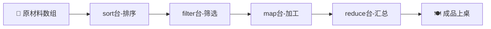
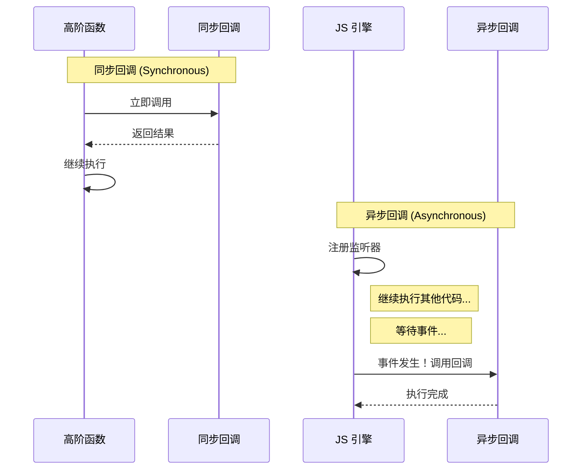
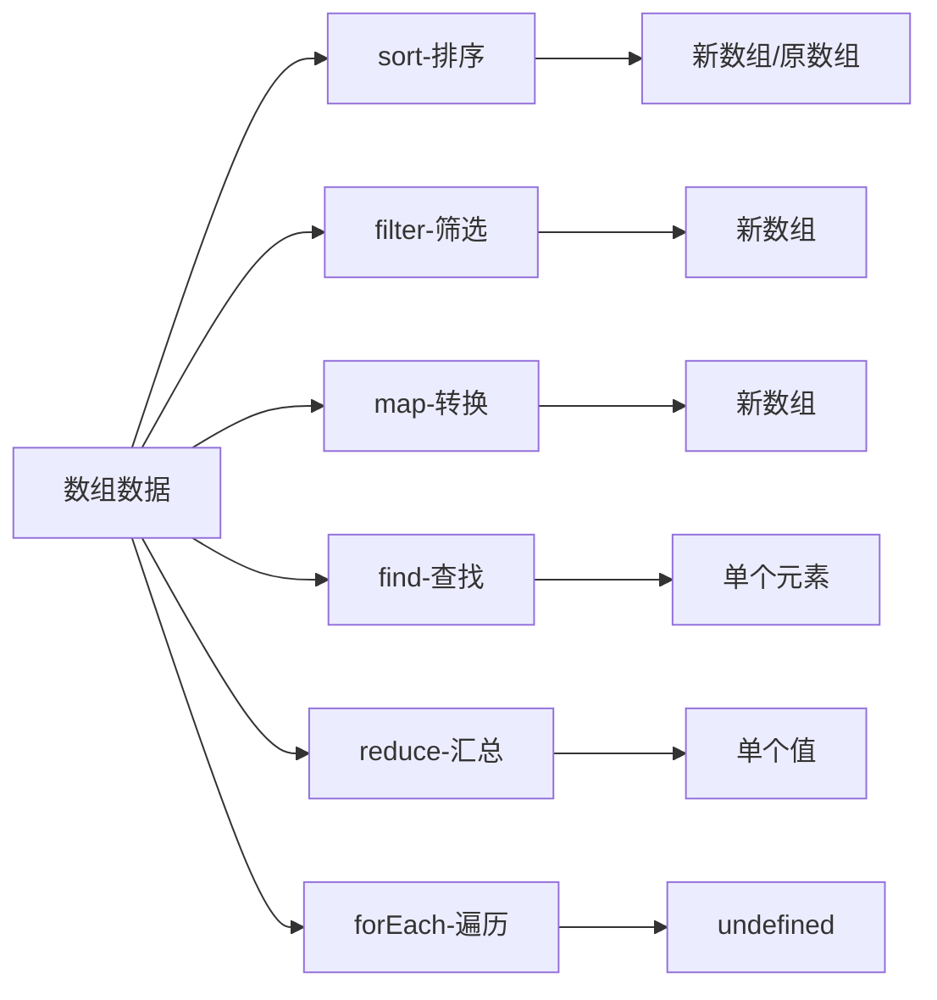

# 02 - JS 回调与高阶函数

> 上一站: [01_setup.md](./01_setup.md) - 环境搭建  
> 下一站: [03_rendering.md](./03_rendering.md) - JSX 渲染

---

## 🍳 引言：餐厅后厨流水线

想象一家繁忙餐厅的后厨：

- **原材料数组** = 一筐刚送来的蔬菜 `[茄子, 西红柿, 黄瓜, 土豆]`
- **sort 台** = 按大小分类摆盘
- **filter 台** = 挑出新鲜合格的
- **map 台** = 切片、切块、切丝
- **reduce 台** = 统计重量、计算成本

在这个流水线上，每个"工序台"就是**高阶函数 (HOF)**，而具体的"操作步骤"（怎么挑、怎么切）就是**回调函数 (Callback)**。



**核心概念**:
- **HOF (高阶函数)**: 接收函数作为参数的函数
- **Callback (回调函数)**: 被传递给 HOF，由 HOF 决定何时调用

---

## 🤔 什么是回调函数？

**关键区别**: 回调函数**不是**被你直接调用的！

```javascript
// ❌ 错误：直接调用回调
myCallback()

// ✅ 正确：把回调传给 HOF，让它来调用
array.filter(myCallback)  // filter 自己决定何时调用 myCallback
```

**为什么要叫"回调"？**

想象一下：你给餐厅留了电话，说"菜好了叫我"。你不是自己一直去厨房问，而是**等餐厅回调你**。同样，你把函数传给 HOF，告诉它"需要处理时调用这个函数"。

---

## ✏️ 命名规范（重要！）

老师反复强调的编码规范：

| 规则 | 说明 | 示例 |
|:---|:---|:---|
| **必须命名** | 不要用匿名函数 | `function keepSedansCB()` ✅ |
| **必须以 CB 结尾** | 一看就知道是回调 | `isFreshCB`, `sortByPriceCB` |
| **描述功能** | 名字要说明做什么 | `keepSedansCB` 比 `cb1` 好 |

```javascript
// ✅ 正确写法
function keepSedansCB(car) {
    return car.doors === 4;
}
cars.filter(keepSedansCB);

// ❌ 错误写法（匿名箭头函数）
cars.filter(car => car.doors === 4);
```

**为什么要命名？**
- 调试时堆栈跟踪显示函数名，快速定位问题
- 代码可读性：一眼看出回调的用途
- 养成好习惯，工程代码必备

---

## 🛠️ 六大数组 HOF 详解

### 1. `arr.sort(comparatorCB)` - 排序台

**作用**: 按指定规则排序数组元素

**餐厅类比**: 按大小把食材重新摆盘

```javascript
const fruits = ['banana', 'apple', 'cherry'];

function compareLengthCB(a, b) {
    return a.length - b.length;  // 短的在前
}

fruits.sort(compareLengthCB);
// 结果: ['apple', 'banana', 'cherry']
```

**比较函数返回值**:
| 返回值 | 含义 |
|:---|:---|
| `< 0` | a 排在 b 前面 |
| `> 0` | a 排在 b 后面 |
| `0` | 保持原位 |

⚠️ **避坑**: `sort()` 会**修改原数组**！

```javascript
// ❌ 危险：直接排序原数组（可能触发无限循环）
cars.sort(compCB);

// ✅ 安全：先复制再排序
[...cars].sort(compCB);  // ES6 展开运算符复制
```

---

### 2. `arr.filter(testerCB)` - 筛选台

**作用**: 保留符合条件的元素，返回新数组

**餐厅类比**: 挑出新鲜、合格的食材，扔掉坏的

```javascript
const cars = [
    {make: 'Toyota', model: 'Camry', doors: 4},
    {make: 'Honda', model: 'Civic', doors: 4},
    {make: 'Ford', model: 'Mustang', doors: 2}
];

function keepFourDoorsCB(car) {
    return car.doors === 4;  // 返回 truthy 就保留
}

const fourDoorCars = cars.filter(keepFourDoorsCB);
// 结果: [{Toyota Camry}, {Honda Civic}]
```

**回调参数** (可选):
```javascript
function testerCB(element, index, array) {
    // element: 当前元素
    // index: 当前索引
    // array: 原数组（一般不用）
}
```

---

### 3. `arr.map(transformerCB)` - 加工台

**作用**: 将每个元素转换成新值，返回新数组

**餐厅类比**: 把所有食材切片装盘（一一对应）

```javascript
const numbers = [1, 2, 3, 4];

function doubleCB(num) {
    return num * 2;
}

const doubled = numbers.map(doubleCB);
// 结果: [2, 4, 6, 8]
```

**经典场景**: 从对象数组提取特定字段

```javascript
function getMakeCB(car) {
    return car.make;
}

const brands = cars.map(getMakeCB);
// 结果: ['Toyota', 'Honda', 'Ford']
```

**注意**: `map` 总是**一一对应**，输入 5 个元素，输出也是 5 个元素。

---

### 4. `arr.find(testerCB)` - 寻找台

**作用**: 找到**第一个**符合条件的元素，立即返回

**餐厅类比**: 从一筐西红柿里找出一个最红的（找到就停）

```javascript
function findMustangCB(car) {
    return car.model === 'Mustang';
}

const mustang = cars.find(findMustangCB);
// 结果: {make: 'Ford', model: 'Mustang', doors: 2}

const ferrari = cars.find(isFerrariCB);
// 结果: undefined（没找到）
```

**filter vs find 区别**:
| 特性 | `filter` | `find` |
|:---|:---|:---|
| 返回值 | 数组（所有匹配） | 单个元素/undefined |
| 查找数量 | 全部 | 第一个 |
| 找不到时 | `[]`（空数组） | `undefined` |

---

### 5. `arr.reduce(reducerCB, initialValue)` - 汇总台

**作用**: 把数组"归约"成单个值（累加、统计、分组等）

**餐厅类比**: 统计所有食材的总重量、总成本

```javascript
const nums = [1, 2, 3, 4, 5];

function sumCB(accumulator, current) {
    return accumulator + current;
}

const total = nums.reduce(sumCB, 0);
// 过程: 0+1=1, 1+2=3, 3+3=6, 6+4=10, 10+5=15
// 结果: 15
```

**参数详解**:
- `accumulator`: 累加器，保存中间结果
- `current`: 当前元素
- `initialValue`: 初始值（**千万别忘！**）

⚠️ **避坑**: 忘记初始值会得到意想不到的结果！

```javascript
// ❌ 错误：没给初始值
const sum = nums.reduce(sumCB);  // 以第一个元素为初始值

// ✅ 正确：显式给初始值
const sum = nums.reduce(sumCB, 0);
```

**实战：统计汽车总门数**

```javascript
function countDoorsCB(total, car) {
    return total + car.doors;
}

const totalDoors = cars.reduce(countDoorsCB, 0);
// 结果: 10 (4+4+2)
```

---

### 6. `arr.forEach(executorCB)` - 逐一台

**作用**: 对每个元素执行副作用（打印、修改外部变量等）

**餐厅类比**: 给每个食材贴标签

```javascript
function logCarCB(car, index) {
    console.log(`${index + 1}. ${car.make} ${car.model}`);
}

cars.forEach(logCarCB);
// 输出:
// 1. Toyota Camry
// 2. Honda Civic
// 3. Ford Mustang
```

⚠️ **避坑**: `forEach` **不返回值**（返回 `undefined`），不能链式调用！

```javascript
// ❌ 错误：试图链式调用
const result = cars
    .forEach(logCB)    // 返回 undefined
    .map(something);   // 报错！Cannot read property 'map' of undefined

// ✅ 正确：forEach 应该放在最后
const result = cars.map(transformCB).forEach(logCB);
```

---

## 🔄 回调嵌套与闭包 (Closure)

**场景**: 回调需要访问外层的参数

```javascript
function carsMadeBy(brand) {
    // 外层参数 brand = 'Toyota'
    return cars.filter(isCarOfBrandCB);
    
    function isCarOfBrandCB(car) {
        // 内层回调访问外层 brand
        return car.make === brand;
    }
}

const toyotaCars = carsMadeBy('Toyota');
```

**为什么能访问？**

这利用了 JavaScript 的**闭包 (Closure)** 机制：内层函数可以"记住"它被创建时的外层作用域。

**函数提升 (Hoisting)**

注意 `isCarOfBrandCB` 定义在 `return` 语句**之后**，这能工作是因为 JavaScript 会把函数声明提升到作用域顶部。

```javascript
// 实际执行顺序（概念上）
function carsMadeBy(brand) {
    // 函数被提升到这里
    function isCarOfBrandCB(car) {
        return car.make === brand;
    }
    
    return cars.filter(isCarOfBrandCB);
}
```

---

## ⏱️ 同步 vs 异步回调

不是所有回调都一样！关键区别是**谁调用、何时调用**：



| 特性 | 同步回调 | 异步回调 |
|:---|:---|:---|
| **调用者** | HOF (如 `map`, `filter`) | JS 引擎 / 事件系统 |
| **调用时机** | 立刻执行 | 未来某个时刻 |
| **典型例子** | `sort`, `map`, `filter` | `setTimeout`, `addEventListener` |
| **执行顺序** | HOF 完成前 | 注册完成后 |

**异步回调场景**:
- 用户点击按钮 (`onClick`)
- 网络请求返回 (`fetch().then()`)
- 定时器触发 (`setTimeout`)

💡 **预告**: 异步回调的详细讲解在 [06_fetch_async.md](./06_fetch_async.md)

---

## 📝 实战练习 (TW1.1 场景)

假设你有以下数据：

```javascript
const cars = [
    {make: 'Toyota', model: 'Camry', doors: 4, year: 2020},
    {make: 'Honda', model: 'Civic', doors: 4, year: 2019},
    {make: 'Ford', model: 'Mustang', doors: 2, year: 2021},
    {make: 'Toyota', model: 'Corolla', doors: 4, year: 2018},
    {make: 'Honda', model: 'Accord', doors: 4, year: 2020}
];
```

**练习 1**: 筛选出所有 4 门车
<details>
<summary>答案</summary>

```javascript
function keepFourDoorsCB(car) {
    return car.doors === 4;
}
const fourDoorCars = cars.filter(keepFourDoorsCB);
```
</details>

**练习 2**: 提取所有车的品牌名（去重前）
<details>
<summary>答案</summary>

```javascript
function getMakeCB(car) {
    return car.make;
}
const makes = cars.map(getMakeCB);
// 结果: ['Toyota', 'Honda', 'Ford', 'Toyota', 'Honda']
```
</details>

**练习 3**: 按年份降序排序（新车在前）
<details>
<summary>答案</summary>

```javascript
function sortByYearDescCB(a, b) {
    return b.year - a.year;  // 降序：大的在前
}
const sorted = [...cars].sort(sortByYearDescCB);
```
</details>

**练习 4**: 计算所有车的总门数
<details>
<summary>答案</summary>

```javascript
function countDoorsCB(total, car) {
    return total + car.doors;
}
const totalDoors = cars.reduce(countDoorsCB, 0);
// 结果: 18
```
</details>

---

## ⚠️ 避坑提醒

1. **sort 会修改原数组**
   ```javascript
   // 总是这样写
   const sorted = [...original].sort(compCB);
   ```

2. **reduce 别忘了初始值**
   ```javascript
   // 危险：空数组时会报错
   [].reduce(sumCB);  // TypeError!
   
   // 安全：给初始值
   [].reduce(sumCB, 0);  // 返回 0
   ```

3. **forEach 不返回值**
   ```javascript
   // 不能链式调用！
   arr.forEach(cb).map(cb2);  // ❌
   ```

4. **回调必须命名**
   ```javascript
   // 虽然箭头函数能工作...
   cars.filter(c => c.doors === 4);
   
   // 但课程要求命名，养成好习惯
   cars.filter(keepFourDoorsCB);
   ```

---

## 💡 TA 问答

**Q1: 为什么回调必须命名，不能用箭头函数？**

> 箭头函数确实能用，但命名回调有三大好处：
> 1. **调试友好** - 报错时堆栈跟踪显示函数名
> 2. **自文档化** - 函数名说明用途，不用读代码
> 3. **工程规范** - 养成可维护代码的好习惯

**Q2: `filter` 和 `find` 到底怎么选？**

> - 需要**所有匹配结果** → 用 `filter`（返回数组）
> - 只需要**第一个**或判断"有没有" → 用 `find`（返回元素或 undefined）
> 
> 性能角度：`find` 找到第一个就停，`filter` 会遍历整个数组。

**Q3: 什么时候用 `forEach`，什么时候用 `map`？**

> - **`map`**: 需要**返回新数组**，转换每个元素
> - **`forEach`**: 只需要**副作用**（打印、修改外部变量），不返回值
> 
> 黄金法则：能用 `map` 就不用 `forEach`，因为 `map` 更纯粹、可链式。

**Q4: 闭包里的回调，函数定义放后面不会报错吗？**

> 不会！JavaScript 有**函数提升 (Hoisting)**，函数声明会被提升到作用域顶部。所以即使在 `return` 后面定义，也能正常工作。

---

## 🎓 本课小结



**核心记忆点**:
- 回调 = 你定义、HOF 调用
- 命名规范：描述功能 + CB 结尾
- `sort` 改原数组，记得复制
- `reduce` 给初始值，别忘记
- `forEach` 不返回，不能链式

---

## 📚 扩展资源

- **课程视频**: https://play.kth.se/media/Callbacks/0_ramy4ikb (20 min)
- **在线练习**: https://stackblitz.com/edit/dh2642-callbacks
- **MDN 文档**: `mdn array sort`, `mdn array filter`

---

**上一站**: [01_setup.md](./01_setup.md) - 环境搭建  
**下一站**: [03_rendering.md](./03_rendering.md) - JSX 渲染

---

*最后更新: 2026-02-18*
