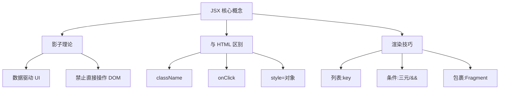

# 03 - JSX 渲染：数据在界面上的"影子" 🎨

> 上一站: [02_callbacks.md](./02_callbacks.md) - JS 回调与高阶函数  
> 下一站: [04_mvp_intro.md](./04_mvp_intro.md) - MVP 架构入门

---

## 🌞 引言：影子理论

想象一下你站在阳光下：
- **光源** = React State (数据)
- **你的身体** = JSX 模板
- **地面上的影子** = 浏览器显示的 UI

```mermaid
graph LR
    A[State数据] --"像光源照亮..."--> B[JSX模板]
    B --"投射出..."--> C[浏览器UI]
    A -."变化时."-> C["影子自动跟随变化!"]
```

**核心规则**：光源变了（数据更新）→ 影子自动跟着变（UI 重绘）。你**不需要**手动去改 DOM！

在 TW1.2 中，JSX 是你唯一的画笔。但请记住：**你画的是数据的影子，不是画本身**。

---

## ⚠️ JSX 不是 HTML

虽然长得像，但 JSX 是 JavaScript 的语法糖。老师在 TW1.2 中特别强调这几个坑：

| HTML | JSX | 为什么 |
|:---|:---|:---|
| `class` | `className` | `class` 是 JS 保留字 |
| `for` | `htmlFor` | `for` 是循环关键字 |
| `onclick` | `onClick` | 驼峰命名规范 |
| `<br>` | `<br/>` | 所有标签必须闭合 |
| `style="color:red"` | `style={{color: 'red'}}` | 传对象，不是字符串 |
| `<!-- 注释 -->` | `{/* 注释 */}` | JS 多行注释语法 |

---

## 🍳 实战：从数据到影子

假设我们在做 TW1 的菜谱展示：

```jsx
// 数据源 (Model)
const dish = {
  name: "宫保鸡丁",
  price: 58,
  spicy: true
};

// View 组件
function DishView({dish}) {
  return (
    <div className="dish-card">
      <h2>{dish.name}</h2>
      <p>¥{dish.price}</p>
      {dish.spicy && <span className="spicy-tag">🌶️ 辣</span>}
    </div>
  );
}
```

看到没？**`{dish.name}`** 就是大括号里的 JavaScript 表达式，它会自动把数据"投影"到界面上。

### 大括号里能写什么？

```jsx
// ✅ 表达式都可以
<h1>{dish.name}</h1>                    // 变量
<p>{dish.price * 0.8}</p>               // 计算
<span>{isSpicy ? "🌶️" : "🥒"}</span>     // 三元运算
<div>{items.length > 0 && <List />}</div>  // 短路求值

// ❌ 语句不行（if/for/while）
<p>{if (x) return y}</p>   // 报错！
```

---

## 🆔 列表渲染：用 key 做身份证

TW1.2 一定会让你渲染列表（比如一堆菜谱）。React 需要你给每个列表项一个 **唯一的 key**：

```jsx
// ✅ 正确：用数据的唯一 ID
{dishList.map(dish => (
  <DishView key={dish.id} dish={dish} />
))}

// ❌ 错误：用数组索引 (index) 当 key
{dishList.map((dish, index) => (
  <DishView key={index} dish={dish} />  // 别这样！
))}
```

**为什么不能用 index？**

想象一下，如果你删掉了数组第一个元素，后面所有元素的 index 都会变，React 会以为是完全不同的数据，导致：
1. 性能暴跌（不必要的重渲染）
2. 状态错乱（比如输入框内容错位）

**Key 的黄金法则**：
- 用数据的**业务 ID**（如 `dish.id`, `user.userId`）
- 确保在同一列表中**唯一且稳定**
- **不要用随机数**（每次渲染都变）

---

## 🔄 条件渲染：数据决定显示什么

在 MVP 模式中，View 应该根据 Presenter 给的 props 决定渲染什么：

### 方法 1：if 语句提前返回

```jsx
function StatusView({promiseState}) {
  // 三段式状态显示
  if (promiseState.error) {
    return <div className="error">出错了: {promiseState.error}</div>;
  }
  
  if (!promiseState.data) {
    return <div className="loading">加载中... ⏳</div>;
  }
  
  return <div className="content">{promiseState.data}</div>;
}
```

### 方法 2：三元运算符（简单场景）

```jsx
function UserGreeting({isLoggedIn, username}) {
  return (
    <div>
      {isLoggedIn 
        ? <h1>欢迎回来, {username}!</h1> 
        : <h1>请登录</h1>
      }
    </div>
  );
}
```

### 方法 3：逻辑与运算符 &&

```jsx
function Notification({message}) {
  return (
    <div>
      <h2>通知中心</h2>
      {message && <p className="alert">{message}</p>}
      {/* message 为真时才渲染 */}
    </div>
  );
}
```

---

## 📦 根元素包裹

JSX 必须返回**一个**根元素。如果有多个并列元素，用空标签 `<>`（Fragment）包裹：

```jsx
// ✅ 正确：用 Fragment 包裹
return (
  <>
    <header>标题</header>
    <main>内容</main>
    <footer>页脚</footer>
  </>
);

// ✅ 也可以带 key 的 Fragment
return (
  <React.Fragment key={item.id}>
    <td>{item.name}</td>
    <td>{item.price}</td>
  </React.Fragment>
);

// ❌ 错误：没有根元素
return (
  <header>标题</header>
  <main>内容</main>  // 报错！Adjacent JSX elements
);
```

---

## 🎨 行内样式：双重花括号

JSX 的 style 接收**对象**，不是 CSS 字符串：

```jsx
// ❌ 错误：CSS 字符串
<div style="color: red; fontSize: 16px;">

// ✅ 正确：JS 对象
<div style={{color: 'red', fontSize: 16}}>
  注意属性名用驼峰
</div>

// ✅ 抽离为变量更清晰
const cardStyle = {
  backgroundColor: '#f0f0f0',
  padding: '20px',
  borderRadius: 8
};

<div style={cardStyle}>内容</div>
```

**样式属性命名**：CSS 的 `background-color` → JSX 的 `backgroundColor`（驼峰式）

---

## ⚠️ 避坑指南

### 1. 不要直接碰 DOM

禁止在 View 里写 `document.getElementById`！这是 jQuery 时代的思维，会破坏 React 的响应式系统。

```jsx
// ❌ 错误：直接操作 DOM
function BadView() {
  useEffect(() => {
    document.getElementById('title').style.color = 'red';
  }, []);
  return <h1 id="title">标题</h1>;
}

// ✅ 正确：用 state 驱动渲染
function GoodView() {
  const [color, setColor] = useState('red');
  return <h1 style={{color}}>标题</h1>;
}
```

### 2. 不要在 View 里做复杂计算

复杂的计算逻辑交给 Presenter，View 只负责"投影"。

```jsx
// ❌ 错误：在 View 里做计算
function BadCart({items}) {
  return (
    <div>
      <p>总价: {items.reduce((a,b) => a + b.price * b.quantity, 0)}</p>
    </div>
  );
}

// ✅ 正确：Presenter 算好，View 直接用
function GoodCart({items, totalPrice}) {
  return (
    <div>
      <p>总价: ¥{totalPrice}</p>
    </div>
  );
}
```

### 3. 大括号里是表达式，不是语句

不能写 `if`/`for`/`return`，但可以用三元运算符：

```jsx
// ✅ 可以：表达式
{isLoading ? <Spinner /> : <Content />}
{items.length > 0 && <ItemList items={items} />}

// ❌ 不行：语句
{if (isLoading) return <Spinner />}
{for (let i of items) { ... }}
```

### 4. 事件处理要传函数，不要调用

```jsx
// ❌ 错误：立刻执行（页面渲染时就 alert 了）
<button onClick={alert(' clicked!')}>点击</button>

// ✅ 正确：传函数引用
<button onClick={() => alert('clicked!')}>点击</button>
<button onClick={handleClick}>点击</button>
```

---

## 📝 实战练习

假设你有以下数据：

```jsx
const menu = [
  {id: 1, name: '宫保鸡丁', price: 48, spicy: true},
  {id: 2, name: '糖醋排骨', price: 68, spicy: false},
  {id: 3, name: '麻婆豆腐', price: 28, spicy: true},
  {id: 4, name: '清蒸鲈鱼', price: 88, spicy: false}
];
```

**练习 1**: 渲染菜单列表，每道菜显示名称和价格
<details>
<summary>答案</summary>

```jsx
function MenuView({menu}) {
  return (
    <div>
      {menu.map(dish => (
        <div key={dish.id}>
          <span>{dish.name}</span>
          <span>¥{dish.price}</span>
        </div>
      ))}
    </div>
  );
}
```
</details>

**练习 2**: 只显示辣菜，并在菜名后加 🌶️ 标识
<details>
<summary>答案</summary>

```jsx
function SpicyMenuView({menu}) {
  const spicyDishes = menu.filter(d => d.spicy);
  
  return (
    <div>
      <h2>辣味专区 🌶️</h2>
      {spicyDishes.map(dish => (
        <div key={dish.id}>
          <span>{dish.name} 🌶️</span>
          <span>¥{dish.price}</span>
        </div>
      ))}
    </div>
  );
}
```
</details>

**练习 3**: 如果没有菜品，显示"菜单为空"
<details>
<summary>答案</summary>

```jsx
function MenuView({menu}) {
  if (menu.length === 0) {
    return <p>菜单为空</p>;
  }
  
  return (
    <div>
      {menu.map(dish => (
        <div key={dish.id}>{dish.name}</div>
      ))}
    </div>
  );
}
```
</details>

---

## 💡 TA 问答

**Q1: 为什么我们在 View 里面不写 setState？**

> 因为 View 是被动的"影子"，只负责根据 Presenter 给的 props 渲染 UI。状态变更的逻辑应该由 Presenter 处理，View 通过触发自定义事件通知 Presenter，而不是直接操作状态。

**Q2: 可以用 index 做 key 吗？**

> 只有在列表**不会变**（不增删改顺序）时才可以用。如果有动态操作，必须用稳定的业务 ID，否则会导致渲染错误。

**Q3: Fragment 和 div 有什么区别？**

> Fragment (`<>...</>`) 不会生成真实的 DOM 节点，而 `div` 会。使用 Fragment 可以避免不必要的嵌套，保持 DOM 结构简洁。

**Q4: 为什么我的图片不显示？**

> JSX 里图片路径要用 `import` 或 `require`：
> ```jsx
> // ❌ 直接写路径
> 
> 
> // ✅ 正确方式
> import logo from './logo.png';
> 
> ```

---

## 🎓 本课小结



**核心记忆点**:
- JSX = 数据的影子，不是 HTML
- `className` 不是 `class`，`onClick` 驼峰命名
- 列表必须用 `key`，且要稳定唯一
- 条件渲染用三元或 `&&`
- 多元素用 `<>` Fragment 包裹
- View 只投影，不计算，不直接操作 DOM

---

## 📚 扩展资源

- **课程视频**: https://play.kth.se/media/JSX+Rendering/0_abc123 (18 min)
- **在线练习**: https://stackblitz.com/edit/dh2642-jsx
- **MDN 文档**: `mdn react jsx`, `mdn react lists and keys`

---

**上一站**: [02_callbacks.md](./02_callbacks.md) - JS 回调与高阶函数  
**下一站**: [04_mvp_intro.md](./04_mvp_intro.md) - MVP 架构入门

---

*最后更新: 2026-02-18*
