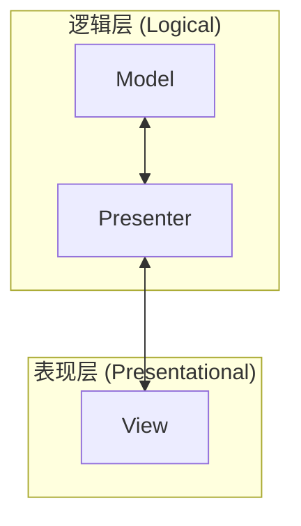

# 04 - MVP 架构：分而治之的艺术 🏗️

> 上一站: [03_rendering.md](./03_rendering.md) - JSX 渲染  
> 下一站: [05_reactivity.md](./05_reactivity.md) - 响应式原理

---

## 🌞 引言：为什么需要 MVP？

在 ID2216 的大作业中，你将面临成千上万行代码。如果把所有逻辑（数据获取、状态更新、界面渲染）都塞进一个文件，代码会变成一团乱麻。

**MVP (Model-View-Presenter)** 是一种架构模式，它的核心目标是：**解耦**。

### 角色分工

1. **Model (模型/数据)**: 纯数据和业务逻辑。它不知道 UI 的存在。
2. **View (视图/影子)**: 纯 UI 渲染。它不知道数据是怎么来的，只负责展示 Props 并触发事件。
3. **Presenter (主持人/桥梁)**: 粘合剂。它从 Model 获取数据，传给 View，并处理 View 触发的事件。

---

## 🏗️ 架构图示



在 React 应用中，这通常表现为：
- **Model**: `model.js` (普通 JS 对象)
- **View**: `View.jsx` (函数组件)
- **Presenter**: `Presenter.jsx` (连接 Model 和 View 的组件)

---

## 🍳 案例：计数器

### 1. View (纯 UI)
View 只接收 `count` 和 `onIncrement`。它不关心 `count` 是存在本地还是服务器。

```jsx
// CounterView.jsx
function CounterView({count, onIncrement}) {
    return (
        <div>
            <p>当前数值: {count}</p>
            <button onClick={onIncrement}>增加</button>
        </div>
    );
}
```

### 2. Presenter (桥梁)
Presenter 负责处理逻辑并把数据喂给 View。

```jsx
// CounterPresenter.jsx
import CounterView from "./CounterView";

function CounterPresenter({model}) {
    // 监听模型变化并触发重绘 (简化逻辑)
    const count = model.counter;
    
    function handleIncrement() {
        model.increment(); // 调用 Model 的方法
    }

    return (
        <CounterView 
            count={count} 
            onIncrement={handleIncrement} 
        />
    );
}
```

### 3. Model (数据)
Model 是纯粹的 JS。

```js
// model.js
const model = {
    counter: 0,
    increment() {
        this.counter++;
    }
};
```

---

## ⚠️ 避坑指南

### 1. 不要让 View 直接修改 Model
View 应该通过 `props` 传回来的回调函数（如 `onIncrement`）来通知 Presenter，由 Presenter 去改 Model。

### 2. Presenter 里不要写 HTML
Presenter 的 `return` 应该尽量只包含 View 组件，而不是一堆 `div` 和 `css`。

### 3. Model 应该是独立的
你应该能够在没有 React 的情况下测试你的 Model 逻辑。

---

## 💡 TA 问答

**Q: 为什么我要写这么多文件？在一个文件里写不是更快吗？**

> 对于小项目确实。但在大作业中，MVP 让团队协作变得简单：一个人可以专门写 View 的样式，另一个人写 Model 的业务逻辑，互不干扰。同时，这极大地方便了自动化测试。

---

## 🎓 本课小结

- **Model**: 存数据。
- **View**: 画界面。
- **Presenter**: 做连接。

---

**上一站**: [03_rendering.md](./03_rendering.md) - JSX 渲染  
**下一站**: [05_reactivity.md](./05_reactivity.md) - 响应式原理
