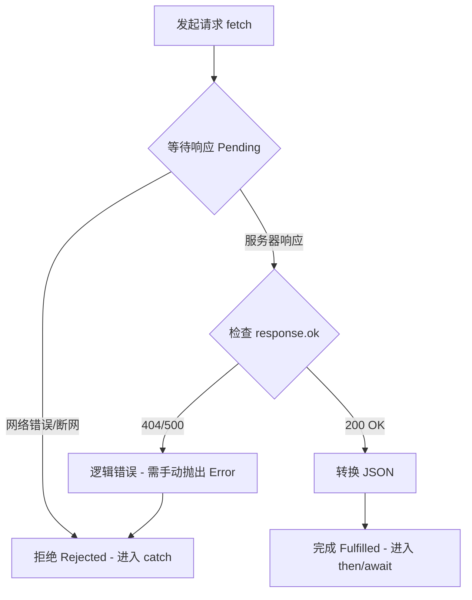

# 06 异步 Fetch：如何优雅地向服务器“点餐”？

> 💡 **回顾**：在上一章 [05 响应式原理](./05_reactivity.md) 中，我们学习了如何让视图监听 Model 的变化。这一章，我们将学习如何让 Model 主动去外界获取数据。

在交互式编程中，你的应用不再是“单机版”。它需要从互联网上获取数据（比如餐厅列表、天气信息）。在 JavaScript 中，这一切都围绕着 `fetch` 和 **Promise** 展开。

## 1. 餐厅类比：Promise 的真相

想象你去一家很火的餐厅（API 服务器）点餐：

1. **下单 (`fetch`)**：你向服务员点了一个汉堡。
2. **小票 (Promise)**：服务员没有立刻给你汉堡（因为还没做），而是给了你一张**订单小票**。
3. **等待 (Pending)**：小票代表一个承诺：汉堡做好了会给你，或者汉堡卖完了会告诉你。
4. **结果**：
   - **完成 (Fulfilled)**：厨师做好了，你用小票换到了汉堡 (`.then()`)。
   - **拒绝 (Rejected)**：厨师发现没食材了，告诉你做不了 (`.catch()`)。

---

## 2. 核心语法：Fetch 基础

在 ID2216 中，我们通常这样获取数据：

```javascript
fetch("https://api.example.com/data")
  .then(function(response) {
    // 步骤 A: 检查网络响应是否成功
    if (!response.ok) {
       throw new Error("网络响应不给力: " + response.status);
    }
    // 步骤 B: 将原始数据转换成 JSON 格式 (这也是一个异步过程)
    return response.json(); 
  })
  .then(function(data) {
    // 步骤 C: 真正拿到了数据！
    console.log("拿到数据了:", data);
  })
  .catch(function(error) {
    // 步骤 D: 处理任何环节出现的错误
    console.error("出错了:", error);
  });
```

## 3. 升级版：Async / Await (让代码更像“人话”)

`.then()` 链条太长了会让人眼花缭乱。现代 JavaScript 提供了 `async/await` 语法，它就像是在点餐时**等在柜台前**直到拿到东西：

```javascript
async function getDinner() {
  try {
    const response = await fetch("https://api.example.com/dinner");
    
    if (!response.ok) throw new Error("餐厅关门了");

    const data = await response.json();
    console.log("晚饭到手:", data);
  } catch (error) {
    console.error("没吃上饭:", error);
  }
}
```

**关键规则：**
- 只能在带有 `async` 关键字的函数内部使用 `await`。
- `await` 会暂停代码执行，直到 Promise 变成“完成”状态，并直接返回结果。

## 4. 连环夺命 Call：Promise.all (同时下单)

有时候你需要同时请求多个资源（比如：菜单、天气、位置）。如果一个一个等，太慢了。`Promise.all` 允许你发起“满汉全席”式的请求：

```javascript
async function getEverything() {
  const [menu, weather] = await Promise.all([
    fetch("/api/menu").then(r => r.json()),
    fetch("/api/weather").then(r => r.json())
  ]);
  console.log("菜单和天气都到齐了！", menu, weather);
}
```

## 5. 状态转移：从发起请求到拿到数据

我们可以用 Mermaid 流程图清晰地看到 Fetch 的生命周期：



## 💡 TA 问答：新手最容易掉的坑

**问：既然 `fetch` 有 `.catch()`，为什么还要手动 `if(!response.ok) throw ...`？**

**答：** 这是 `fetch` API 最“坑”的地方！**只要服务器给了响应（哪怕是 404 或 500），`fetch` 都会认为请求“成功”了**（Promise 会变成 Fulfilled）。只有在网络断了、跨域限制（CORS）或者域名解析失败时，它才会进入 `catch`。所以，你必须手动检查 `response.ok`。

## 6. 实战：在 Model 中封装 Fetch

在 ID2216 的 MVP 架构中，Fetch 不应该散落在各处，而应该封装在 **Model** 的方法中。

### 6.1 基础模式：保存 Promise
为了让视图能显示“加载中”，我们通常在 Model 里维护一个 `currentPromise`：

```javascript
// model.js
const model = {
    searchResultsPromiseState: {}, // 存放 Promise 的状态
    
    doSearch(params) {
        // 1. 发起请求，并将返回的 Promise 存起来
        this.searchResultsPromiseState.promise = fetch(...)
            .then(response => {
                if(!response.ok) throw new Error("搜索失败");
                return response.json();
            });
            
        // 2. 通知所有观察者：数据正在路上！
        this.notifyObservers({ searchStarted: true });
    }
};
```

### 6.2 进阶：处理“竞态条件” (Race Condition)
想象你快速搜索了“汉堡”然后立刻改搜“披萨”。如果“汉堡”的请求因为网络延迟比“披萨”慢，最后页面可能会在显示“披萨”后又跳回“汉堡”的结果，这就乱套了。

**防范代码：**

```javascript
doSearch(params) {
    // 1. 发起请求并保存当前的 Promise 引用
    const p = fetch(...)
        .then(response => {
            if(!response.ok) throw new Error("搜索失败: " + response.status);
            return response.json();
        })
        .then(data => {
            // 2. 核心：检查 p 是否仍然是 Model 里最新的那个 Promise
            if (this.searchResultsPromiseState.promise !== p) {
                return;
            }
            // 3. 只有是最新的请求，才处理数据
            this.searchResultsPromiseState.data = data;
            this.notifyObservers();
        });

    // 将当前请求记录为“最新”
    this.searchResultsPromiseState.promise = p;
    this.notifyObservers();
}
```

---
⚠️ **避坑提醒：** 不要直接在 `fetch().then()` 里修改 `this.data` 而不进行版本检查。异步代码的执行顺序是不确定的，这种“先到不一定先得”的情况是前端开发中最常见的 Bug 来源之一。

## 7. 补充：关于 API Key 的安全

在 Canvas 的 TW2.2 部分，老师特别提到了 API 安全性。

### ⚠️ 绝对不要在前端代码中暴露 API Key
虽然在本地练习时我们可以直接把 Key 写入代码，但在真实的生产环境中：
1. **暴露后果**：别人会偷走你的 Key，用你的配额去调用服务，甚至导致你欠费。
2. **解决方法**：通常使用 `.env` 文件（环境变量）配合构建工具，或者通过后端中转请求。

在 ID2216 实验室中，请确保不要将包含 API Key 的代码上传到公共的 GitHub 仓库。

## 8. 实战演练：写一个属于你的“天气查询器”

理论结合实践才是最快的。请尝试完成以下代码，补全缺失的逻辑：

**需求描述**：调用 API 获取指定城市的天气。
1. 使用 `async/await`。
2. 必须检查 `response.ok`。
3. 如果失败，抛出带状态码的错误信息。

```javascript
async function fetchWeather(city) {
    const API_KEY = "你的KEY"; // 仅限本地练习
    const url = `https://api.weather.com/v1/${city}?apikey=${API_KEY}`;

    try {
        const response = await fetch(url);
        
        // --- 请在此处补全逻辑 ---
        // 1. 检查是否成功
        // 2. 转换 JSON
        // 3. 返回数据
        
    } catch (error) {
        console.error("天气获取失败:", error.message);
    }
}
```

**提示：** 别忘了 `response.json()` 本身也是一个异步过程，前面也需要加 `await` 哦！

---

## 📚 扩展阅读
- [MDN: Using Fetch](https://developer.mozilla.org/en-US/docs/Web/API/Fetch_API/Using_Fetch) - 官方最权威的指南
- [JavaScript.info: Fetch](https://javascript.info/fetch) - 深入浅出的异步教程

---
⚠️ **下一站**：我们将学习如何使用 [07 Suspense](./07_suspense.md) 模式完美优雅地处理加载状态。
