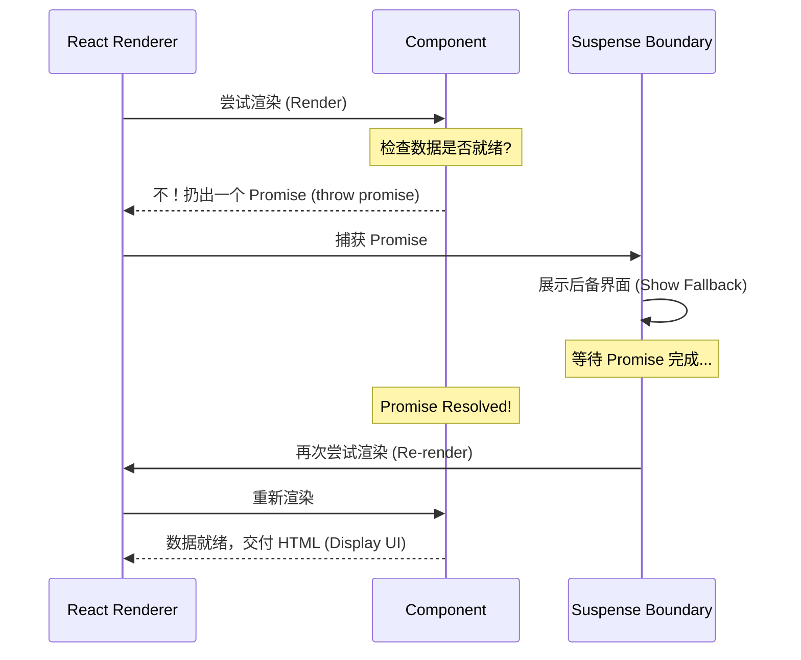

# 07 React Suspense：优雅地处理“加载中”

> 💡 **回顾**：在上一章 [06 异步 Fetch](./06_fetch_async.md) 中，我们学会了如何获取数据。现在我们将学习如何优雅地管理这些数据正在加载时的视觉反馈。

在上一章中，我们学会了如何点餐（Fetch）。但点餐后，汉堡还没做好的这段时间，我们该给用户看什么？是盯着空白的屏幕发呆，还是显示一个旋转的小圈圈？

React **Suspense** 提供了一种声明式的方案，让我们可以优雅地处理异步加载状态。

## 1. 餐厅类比：等待大屏幕

想象你在麦当劳点餐：

1. **点餐成功**：你拿到了小票（Promise）。
2. **挂起 (Suspend)**：汉堡还没做好，柜台服务员不会让你在那傻站着堵住排队的人。
3. **后备方案 (Fallback)**：你会看柜台顶部的**大屏幕**，上面显示着“正在配餐中...”。
4. **交付**：当你的号码出现在“请取餐”一栏时，大屏幕消失，取而代之的是热腾腾的汉堡。

在 React 中，`<Suspense>` 就是那个“大屏幕”。

## 2. 核心架构：`<Suspense>` 组件

```jsx
<Suspense fallback={<LoadingSpinner />}>
   <WeatherDetails /> {/* 这个组件内部会发起异步请求 */}
</Suspense>
```

## 3. 幕后黑魔法：Throwing a Promise

在普通的 JS 中，我们 `throw` 的通常是 Error。但 React 的 Suspense 玩了个花活：**它允许组件 throw 一个 Promise**。

### 运行流程图：


**为什么这很酷？**
因为它让你写异步组件时，感觉像在写同步代码。你不需要在组件里写一大堆 `if(loading) return <Spinner />`，这些繁琐的判断都被 `<Suspense>` 接管了。

## 4. 实战工具：`promise-suspense`

在 ID2216 实验室中，我们不直接手写 `throw promise`。我们使用一个简单的包装库：`promise-suspense`。

### 4.1 如何使用 `usePromise`

```jsx
import usePromise from "promise-suspense";

function WeatherDetails({ model }) {
    // 核心：直接调用，不需要 useEffect！
    // 如果数据还没好，这一行会自动 throw promise 并触发 Suspense
    const data = usePromise(() => model.searchResultsPromiseState.promise);

    return (
        <div>
            <h3>搜索结果</h3>
            <pre>{JSON.stringify(data, null, 2)}</pre>
        </div>
    );
}
```

### 4.2 代码对比：为什么用它？

| 传统方式 (`useEffect`) | Suspense 方式 (`usePromise`) |
| :--- | :--- |
| 需要维护 `loading`, `error`, `data` 三个状态 | 只需要一行 `usePromise` |
| 组件充满了 `if (loading)` 的逻辑判断 | 业务逻辑与加载逻辑完全分离 |
| 容易产生“竞态条件”或内存泄漏 | 加载管理交给 React 调度 |

## 5. 进阶：精细化控制（嵌套 Suspense）

并不是所有的组件都必须共用一个“大屏幕”。你可以通过嵌套多个 `<Suspense>` 来实现更精细的加载体验。

### 5.1 局部加载 vs 整体加载

```jsx
<Suspense fallback={<MainSkeleton />}>
    <Sidebar />
    
    {/* 搜索结果是独立的，不需要等侧边栏加载完才显示骨架 */}
    <Suspense fallback={<SearchLoader />}>
        <SearchResults />
    </Suspense>
</Suspense>
```

**策略选择：**
- **大的 Suspense**：包裹整个页面，适合初始白屏转场。
- **小的 Suspense**：包裹独立的异步组件（如：天气详情、推荐列表），适合提升用户感知的交互流畅度。

## 💡 TA 问答：为什么不建议把全站都包在一个大 Suspense 里？

**问：既然 Suspense 这么好，我直接在 `App.js` 最外层包一个不就行了？**

**答：** 绝对不行！如果你只用一个最外层的 Suspense，那么**只要有一个组件还在加载（Pending），整个页面都会显示 Fallback**。这意味着用户必须等待“最慢”的那个请求完成才能看到任何内容。合理的做法是：让重要的内容（标题、导航）先出来，让不确定的异步内容（评论区、第三方数据）拥有各自独立的小 Suspense。

---

## 6. ⚠️ 避坑提醒：Suspense 不是万能的

很多同学会以为包了 Suspense 就能处理所有异步情况，这是一个大坑！

### 6.1 Suspense 只处理 Pending
记住：Suspense 的触发机制是捕获那个被 `throw` 出来的 **Pending 状态的 Promise**。
- 如果请求**成功**了，Suspense 消失，渲染内容。
- 如果请求**失败**了（Rejected），Suspense 不会显示 Fallback，而是会导致整个应用**崩溃**（抛出未捕获的错误）。

### 6.2 解决方法：配合 Error Boundary
在真实的 ID2216 项目中，你通常需要这样包装：

```jsx
<ErrorBoundary fallback={<ErrorMessage />}>
    <Suspense fallback={<LoadingSkeleton />}>
        <WeatherDetails />
    </Suspense>
</ErrorBoundary>
```

- **Suspense**：负责“等餐”时的进度条。
- **Error Boundary**：负责“厨师跑路/食材没了”时的错误提示。

## 7. 深入理解：Promise 的状态包装 (State Wrapping)

虽然 `promise-suspense` 帮我们处理了大部分工作，但在 ID2216 的某些进阶场景中，你可能需要手动包装一个 Promise。React 并不是魔法，它需要知道 Promise 的“当前状态”才能决定是否暂停渲染。

### 7.1 简易状态包装器 (Simple Wrapper)

```javascript
function wrapPromise(promise) {
    let status = "pending";
    let result;
    let suspender = promise.then(
        (data) => {
            status = "success";
            result = data;
        },
        (error) => {
            status = "error";
            result = error;
        }
    );

    return {
        read() {
            if (status === "pending") {
                // 关键：Pending 时 throw promise，触发最近的 Suspense
                throw suspender; 
            } else if (status === "error") {
                // Error 时 throw error，触发最近的 Error Boundary
                throw result;    
            } else if (status === "success") {
                // Success 时直接返回结果
                return result;   
            }
        },
    };
}
```

**原理剖析：** `Suspense` 本质上是在不断地“重试”渲染组件。组件内部调用 `read()`：
1. **第一次重试**：`status` 是 `pending`，抛出 Promise，React 捕获并展示 Fallback。
2. **数据就绪**：Promise 变为 `success`。
3. **第二次重试**：`status` 是 `success`，`read()` 直接返回数据，组件成功渲染！

## 8. 实战挑战：构建多级加载界面

理论结合实践。请根据以下需求，尝试设计你的 `<Suspense>` 布局。

**需求场景**：
1. 你有一个仪表盘页面 `Dashboard`。
2. 包含一个侧边栏 `Sidebar`（加载数据需要 1 秒）。
3. 包含一个主内容区 `MainChart`（加载数据需要 3 秒）。
4. **目标**：不希望主内容区的缓慢拖累侧边栏的显示。

**请填空补全架构：**

```jsx
function Dashboard() {
    return (
        <div className="dashboard">
            {/* 1. 外层 Suspense 处理页面整体转场 */}
            <Suspense fallback={<PageLoader />}>
                
                {/* 侧边栏 */}
                <Sidebar /> 

                {/* 2. 在此处添加内层 Suspense，隔离主内容的长时间加载 */}
                <Suspense fallback={<ChartSkeleton />}>
                    <MainChart />
                </Suspense>

            </Suspense>
        </div>
    );
}
```

**思考题**：如果把内层的 `<Suspense>` 删掉，用户体验会有什么变化？（答案：用户必须多盯 2 秒钟的 `PageLoader` 才能看到侧边栏）。

---

## 📚 扩展阅读
- [React Docs: Suspense](https://react.dev/reference/react/Suspense) - 官方对 Suspense 的详细定义
- [React.dev: Scaling Up with Suspense](https://react.dev/learn/scaling-up-with-reducer-and-context#scaling-up-with-suspense) - 进阶 UI 设计模式

---
⚠️ **下一站**：我们将学习如何使用 [08 高级状态管理](./08_state_advanced.md)（Recoil）来管理跨组件的复杂异步状态。
