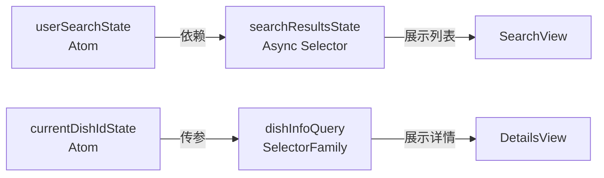

# 08 Recoil：跨组件的高级状态管理

> 💡 **回顾**：在上一章 [07 React Suspense](./07_suspense.md) 中，我们学会了如何处理等待状态。现在，我们将使用 Recoil 将这种异步体验提升到新的高度。

在前面的章节中，我们学习了如何通过 Props 在父子组件间传递数据。但如果你的应用变得非常复杂（比如：深层嵌套的组件都需要访问用户信息），Props 传递就会变成一场噩梦。

**Recoil** 是由 Facebook 开发的一个状态管理库，它让状态管理变得像操作“原子”一样简单。

## 1. 办公室类比：共享公告栏

想象你在一家大公司工作：

1. **传统方式 (Props)**：如果你想把一个消息传给楼下的同事，你必须通过主管、经理、组长，层层传递。一旦中间有人忘了，消息就丢了。
2. **Recoil 方式 (Atoms)**：公司大厅有一个**共享公告栏**。任何人都可以把信息贴上去（Atom），任何人也都可以随时去查看或修改。

在 Recoil 中，每一个状态都是一个独立的“公告”（Atom）。

## 2. 核心概念：Atom (原子状态)

Atom 是 Recoil 的最小状态单位。它们是可订阅的、可更新的。

```javascript
import { atom } from 'recoil';

export const userSearchState = atom({
  key: 'userSearchState', // 唯一标识符
  default: 'pizza',       // 默认值
});
```

## 3. 如何读写状态：常用的 Hooks

在组件中，我们主要使用三个 Hook 来与 Atom 交互。

### 3.1 `useRecoilState` (读 + 写)
这最像 React 的 `useState`。它返回一个包含当前值 and 设置函数的数组。

```jsx
import { useRecoilState } from 'recoil';
import { userSearchState } from './atoms';

function SearchBar() {
  const [query, setQuery] = useRecoilState(userSearchState);
  return <input value={query} onChange={e => setQuery(e.target.value)} />;
}
```

### 3.2 `useRecoilValue` (只读)
如果你只需要读数据，不需要修改它，用这个可以提高性能。

```jsx
const query = useRecoilValue(userSearchState);
```

### 3.3 `useSetRecoilState` (只写)
如果你只需要修改数据（比如一个“重置”按钮），用这个。

```jsx
const setQuery = useSetRecoilState(userSearchState);
```

## 4. 进阶概念：Selector (派生状态)

如果说 Atom 是原始数据，那么 **Selector** 就是对这些数据的“加工厂”。

### 4.1 翻译官类比
想象公告栏上贴了一张用英文写的通知（Atom），但公司里有些同事只懂中文。这时，**Selector** 就像一位翻译官，它读取原始通知，加工成中文版本再展示出来。

### 4.2 核心语法：同步 Selector

```javascript
import { selector } from 'recoil';
import { userSearchState } from './atoms';

export const searchResultsCountState = selector({
  key: 'searchResultsCountState',
  get: ({ get }) => {
    const text = get(userSearchState); // 读取 Atom
    return text.length;               // 加工并返回新值
  },
});
```

**关键点：** 只有当它依赖的 Atom 变化时，Selector 才会重新计算。这非常高效！

## 5. 终极力量：异步 Selector (结合 Suspense)

这是 Recoil 最迷人的地方：它可以让异步请求变得像读取本地变量一样自然。

### 5.1 实战：自动搜索餐厅

```javascript
export const searchResultsState = selector({
  key: 'searchResultsState',
  get: async ({ get }) => {
    const query = get(userSearchState); // 依赖 search 关键词
    if (!query) return [];

    // 像写同步代码一样 await 数据
    const response = await fetch(`https://api.example.com/search?q=${query}`);
    if (!response.ok) throw new Error("搜索请求失败");
    return response.json(); 
  },
});
```

### 5.2 为什么这很神奇？

1. **自动触发 Suspense**：当 `searchResultsState` 正在加载时，它会自动让包含它的组件进入“挂起”状态。你不需要手动处理 `loading` 标志位。
2. **智能缓存**：如果用户搜索了“Pizza”，数据会被自动缓存。下次再搜“Pizza”，Recoil 会秒出结果，不发网络请求。
3. **响应式链条**：一旦上游的 `userSearchState` 改变，Recoil 会自动感知并重新运行这个 `get` 函数。

## 6. 动态工厂：Family (Atom / Selector Family)

如果你的公告栏上需要为每个菜谱都贴一个小信箱，你肯定不想手动写 100 个 Atom。

### 6.1 信箱类比
**Family** 就像是带有 ID 的信箱。你只需要定义一个“信箱模版”，然后通过 ID（参数）来访问特定的状态。

### 6.2 核心语法：`atomFamily`

```javascript
import { atomFamily } from 'recoil';

export const dishDetailsState = atomFamily({
  key: 'dishDetailsState',
  default: id => ({ id, name: '加载中...', description: '' }),
});
```

### 6.3 进阶：`selectorFamily` (传参获取数据)

```javascript
export const dishInfoQuery = selectorFamily({
  key: 'dishInfoQuery',
  get: dishId => async () => {
    const response = await fetch(`https://api.example.com/dishes/${dishId}`);
    return response.json();
  },
});
```

在组件中调用：`const dish = useRecoilValue(dishInfoQuery(42));` —— 就像调用普通函数一样简单！

## 7. 综合实战：从搜索到详情的原子链路

我们将前面学到的 Atom, Selector, Family 串联起来，构建一个完整的搜索链路。

### 7.1 逻辑架构图


### 7.2 代码实现骨架

```javascript
// 1. 记录用户的搜索词
export const userSearchState = atom({ key: 'userSearchState', default: '' });

// 2. 自动派生搜索结果（异步）
export const searchResultsState = selector({
  key: 'searchResultsState',
  get: async ({ get }) => {
    const q = get(userSearchState);
    return q ? fetchResults(q) : [];
  }
});

// 3. 记录当前查看的菜谱 ID
export const currentDishIdState = atom({ key: 'currentDishIdState', default: null });

// 4. 根据 ID 动态获取详情（Family）
export const dishInfoQuery = selectorFamily({
  key: 'dishInfoQuery',
  get: id => async () => id ? fetchDishDetails(id) : null
});
```

## 💡 TA 问答：Recoil 避坑指南

**问：我已经在组件里用了 `useRecoilState`，为什么还是报错说找不到 Recoil 状态？**

**答：** 检查你的 `index.js` 或 `App.js`！Recoil 的所有组件必须被包裹在 `<RecoilRoot>` 标签内。通常我们会把它放在应用的最顶层：
```jsx
root.render(
  <RecoilRoot>
    <App />
  </RecoilRoot>
);
```

**问：如何重置一个 Atom 到它的默认值？**

**答：** Recoil 提供了一个专门的 Hook 叫 `useResetRecoilState`。
```jsx
const resetSearch = useResetRecoilState(userSearchState);
// 调用 resetSearch() 即可
```

**问：我的 Selector 陷入了死循环，一直在不停地发请求，怎么办？**

**答：** 这通常是因为你的 Selector 依赖了一个**每次渲染都会改变**的复杂对象。尽量让 Atom 存储原始、扁平的数据（比如字符串或 ID），而不是存储由组件实时生成的对象。

## 8. 选修：状态持久化 (Persistence)

在真实的 Web 应用中，用户刷新页面后往往希望搜索词还在。我们可以利用 `atom` 的 `effects` 来实现简单的 `localStorage` 同步。

```javascript
const localStorageEffect = key => ({ setSelf, onSet }) => {
  const savedValue = localStorage.getItem(key);
  if (savedValue != null) setSelf(JSON.parse(savedValue));

  onSet((newValue, _, isReset) => {
    isReset
      ? localStorage.removeItem(key)
      : localStorage.setItem(key, JSON.stringify(newValue));
  });
};

export const userSearchState = atom({
  key: 'userSearchState',
  default: '',
  effects: [localStorageEffect('user_search')],
});

---

## 📚 扩展阅读
- [Recoil 官方文档](https://recoiljs.org/) - 详尽的 API 说明与概念指南
- [Learn Recoil](https://learnrecoil.com/) - 优秀的交互式学习资源

---
⚠️ **下一站**：我们将讨论 [09 学术诚信](./09_code_honour.md)，学习在引用 AI 与开源代码时如何保持合规。
